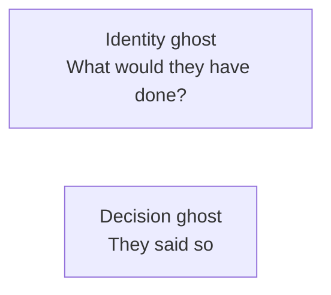
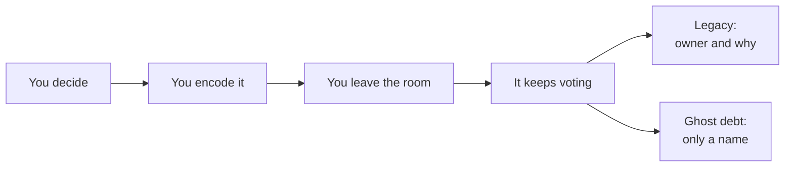

# Your ghost is taking decisions

We had a conversation with an old colleague. At some point they told him that we keep doing things because "he" (the one who left) said so. One of them jokingly said, "your ghost is taking decisions." We all laughed.

I loved this metaphor. I searched immediately whether this had been said before, or whether there were relevant concepts. I found a few things. Nothing sat on the exact line of that joke.

My thoughts took two paths.

One path said: if being a ghost means you had influence in the company, then figuring out how someone becomes a ghost should help you in your career. You would have the steps for gaining influence that lasts after you leave the room.

The other path said: if we accept that ghosts exist, and ghosts take decisions, and each decision leaves something behind, then ghosts leave something behind. I call it ghost debt.

I still think both paths are useful. They also turned out to be the same mechanism. I will come back to that.

## What I found when I searched

The closest named idea is "organizational ghosts." In 2023, Jeffrey Bednar and Jacob Brown published a paper with that title in the Academy of Management Journal. They write about former members who become the picture of "who we are," and who keep affecting people after they leave. People ask "what would they have done?" or imagine them in the room. The famous versions are Disney, Chanel, Jobs, Sam Walton. The paper itself is wider than founders. Long tenure, high visibility, competence plus warmth, then stories, practices, and objects that keep the person around.

That is close. I still think our joke was pointing at something smaller.

Their ghosts are mostly admired leaders. In our conversation, nobody was asking what he would have wanted as our identity. They were using him as a reason. We do this because he said so. The ghost was not inspiring anyone. The ghost was occupying a chair.

I started using a simple test. A ghost is not someone people remember. Teams remember lots of people. A ghost is someone whose absence is still treated as a reason.

There is a second split, and it is the one I care about for this piece:

- Identity ghost: "What would they have done?"
- Decision ghost: "We do this because they said so."

The first still has a question in it. The second is a closed vote. This article is about the second.

## Path 1: how to be a ghost

If influence means your judgment still operates when you are not there, then "how to be a ghost" is a description of influence that worked.

It does not start at the goodbye lunch. It starts earlier, while you are still employed, on the day people stop arguing with the idea and start invoking you.

The sequence looks like this.

You make a judgment others cannot easily reverse. An architecture. A hiring bar. A "we never do that." You encode it, and not only in your head. In language other people reuse. In defaults, tools, checklists, meetings, taboos. Then you leave the room. A meeting, a team, a company. The encoding keeps voting.

Four things survive a person particularly well: stories ("X would hate this"), practices (the review that still happens on Friday), defaults (the template, the named meeting, the lint rule), and forbidden moves (the thing nobody tries because somebody once forbade it).

Visibility helps. Repeated judgment helps. Trust helps. What lasts is the encoding. If people need to remember you for the thing to continue, it is fragile. If it is built into how work moves, it continues.

There is a tell that you are already a ghost on the payroll. People say your name instead of the why. It feels like respect. Sometimes it is. It is also the moment the decision starts to travel without you, which means it can stop being yours to change.

I liked this path because it is practical. If you want influence, you can look at what actually remains after someone leaves, and work backwards.

I also got uneasy with it, for a reason the second path makes obvious. Wanting to be a ghost is wanting your judgment to outlive your calendar. That is how you occupy chairs you will never sit in again.

## Path 2: ghost debt

Technical debt is a shortcut you took. You borrowed time, and you pay interest later. Organizational debt, as Steve Blank used it, is the people and culture compromise made to "just get it done." Process debt is a workflow that helped once and now slows things down. Chesterton's fence is the pause: do not remove a rule until you know why it was put there.

Ghost debt sits next to these and is a different object. It is the cost of a decision that kept operating after it lost its owner. The rule stayed. The context left with the person. The people who remain keep paying, because they cannot renegotiate with the author.

Chesterton's fence says the fence may have a good reason. Ghost debt is what happens when that may still be true, and nobody left can explain the fence, own it, or retire it. Inheritance is normal. Un-owned inheritance is expensive.

The interest is boring, which is why it hides. Extra process that no longer matches the constraint it was built for. Extra fear of touching a thing with someone's name on it. Extra meetings to decode a choice. Extra inability to change, because changing it feels like disloyalty rather than work.

I keep seeing it in four forms.

| Type | What you hear | What you are paying for |
| --- | --- | --- |
| Orphaned why | We always do it this way | A rule whose original constraint is gone |
| Cited authority | He said so | A name doing the work of a reason |
| Fossil process | We still have this meeting | A gate built for their team, scale, or incident |
| Taboo without a priest | We don't do that here | A forbidden move nobody left can un-forbid |

Some of this is unpaid respect for a good fence. A person who left can leave a constraint that still saves you. Ghost debt is not an argument for deleting history. It is an argument for noticing when history is still voting, and whether anyone present can recast that vote.

It looks the same in code. After this method you need to call this method, and nothing in the type system says so. The comment says "always." The tests only pass if you know the order. The person who knew why has left. The compiler did not get the memo.

## The two paths are the same pipeline

This is the part I did not see when we were still only laughing.

Decide. Encode. Leave. The encoding keeps voting.

If the encoding still has a living owner and a living why, I would call that legacy. If it only has a name, it is ghost debt.

The career advice and the warning are the same skill used with different attachments. The way to become a useful ghost is not to make yourself harder to remove. It is to make the decision easier to re-own.

Leave reasons, not only decisions. Leave owners, not only artifacts. Leave the conditions under which you would reverse the call, not only the default.

A decision that cannot be re-opened is not a strong decision. It is a decision that has lost the person who could still argue with it.

## Questions for the living

If you want your judgment to last: would this still make sense if nobody could ask me? Did I write down the why, and when I would reverse it? Who owns this after I leave the room, not after I leave the company?

If you live with someone else's ghost: whose name still ends debates? Which rules have a name and no owner? What would we have to know to retire this, and do we still know it?

I would not turn this into a program. One pass over the decisions that still have a person in them is enough. Keep it, because the fence is still doing work, and now it has an owner. Rewrite the why, because the fence is useful and the original reason is gone. Retire it, because the constraint left with the person.

That pass needs a name, because otherwise people start deleting. I call the pass an **exorcism**. An exorcism here is naming a ghost, not casting it out. You collect candidates. A living person answers whether each one is ghost debt, leftover on purpose, or something that needs a why.

The questions at the end are for the people who still work here:

- Is this still required? If yes, what is the why, and who owns it now?
- If we stopped doing the ritual, what would break?
- Keep, encode the contract into the work, or retire it?
- If this is not ghost debt, what is it?

A living person should answer whether these are ghost debts or we need clarifications about potential ghost debts.

A room can run the same pass without an agent. [9 Whys](https://www.liberatingstructures.com/nine-whys) recovers the purpose until you hit a living reason or silence. Silence is the ghost. [Min Specs](https://www.liberatingstructures.com/min-specs) then strips the folklore from the constraint that still has to stay. The agent skill in this repo does the hunt and stops at the questions. The living still decide.

That pass is a bit rude. It replaces loyalty to a name with loyalty to a reason. Most leftover decisions can survive that. The ones that cannot were already debt.

We laughed because it was funny. It was accurate because the chair was still occupied. If you mattered, you will leave a ghost. The useful question, for me, is whether the people after you inherit a reason, or only a name.
